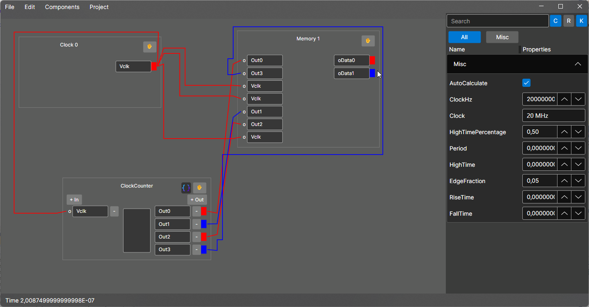

<center>
<h1>High Computational Design</h1>
</br>
</center>

**HighComputationalDesign** is an open-source graphical software written in **C#** and **Avalonia**, designed for the **creation and simulation of digital circuit designs** with 2-state (bit) or 3-state (tribit) logic.  
The main goal is to enable the definition of digital logic **using high-level programming languages** such as **C#** and, soon, **Python**, avoiding the complexity of traditional hardware languages like **Verilog** and **VHDL**.

<center>

<br>
</center>

---

## 🧠 Project Philosophy

The idea behind HighComputationalDesign is to **make hardware design more accessible**, allowing developers to work with familiar tools like C# or Python.  
The aim is to **automate low-level synthesis and simulation processes**, down to the generation of transistor-level circuits, also thanks to the integration of **artificial intelligence techniques**.

---

## 🔍 Main Features

- 🧩 **Interactive graphical design** of 2-bit and 3-bit digital circuits.  
- 💻 **Logic definition via C# scripts** (and Python in future versions).  
- ⚙️ **Accurate simulation with [SpiceSharp](https://github.com/SpiceSharp/SpiceSharp) backend** (SPICE-based).  
- 🧱 **Entity Model System (EMS) architecture** to separate and manage the processor’s internal logic.  
- 📚 Integrated library of **logic components and memory systems** for debugging and testing.  
- 🤖 Automation of hardware synthesis processes down to the lowest level of abstraction (transistor).  
- 🌍 **Cross-platform compatibility**: Windows, Linux, macOS (thanks to .NET 8 and Avalonia).  

---

## ✨ Example: High-Level Counter/Accumulator Script

One of the strengths of **HighComputationalDesign** is the ability to define component logic using C# scripts.  
Below is an example of a **counter** that increments its value every time the input transitions from LOW to HIGH, exposing the value on the first 4 output pins (in binary format):

```csharp
// File Created with HighComputationalDesign in 2025

using CustomComponents;

static class ScriptState
{
    static bool latestState = false;
    static byte counter = 0;

    public static void OnUpdate(ThresholdBiasingBehavior Self)
    {
        bool v = Self.GetInputPin(0);
        if (latestState != v)
        {
            latestState = v;
            if(v)
                counter++;
        }

        var bits = IntToBits(counter, 4);
        
        Self.SetOutputPin(0, bits[0]);
        Self.SetOutputPin(1, bits[1]);
        Self.SetOutputPin(2, bits[2]);
        Self.SetOutputPin(3, bits[3]);
    }
}
```

**What does this script do?**
- Counts the number of rising edges (from 0 to 1) on input pin 0.
- Converts the counter value to 4 bits.
- Outputs each bit on output pins 0–3.

> **Note:** With this approach, you can create complex digital components using C# logic, without writing low-level code!

---

## 🧪 Simulation with SpiceSharp

HighComputationalDesign uses **SpiceSharp** as the backend for electrical simulation, ensuring:  
- High fidelity to the real behavior of circuits.  
- Intuitive parameter configuration via graphical interface.  
- Detailed analysis of the circuit’s temporal and logical behavior.

---

## 🏗️ Architecture

The software adopts an **Entity Model System** architecture, which allows you to:
- Separate the various internal logics (CPU, memory, bus, ALU, etc.);
- Easily extend and modify any part of the system;
- Integrate new types of components or custom modules.

---

## 🧰 Technologies Used

- **Language:** C#  
- **Framework:** .NET 8  
- **UI Framework:** Avalonia UI  
- **Simulator:** SpiceSharp  
- **AI Integration (future):** Automation of synthesis and optimization processes

---

## 💽 Supported Platforms

| Operating System | Support |
|------------------|---------|
| 🪟 Windows | ✅ |
| 🐧 Linux | ✅ |
| 🍎 macOS | ✅ |

---

## 📜 License

HighComputationalDesign is distributed under the **BSD-3-Clause** license, which allows:  
- Free use in **personal and commercial** projects  
- **Modification and redistribution** of the code  
- No obligation for contribution or royalties  

---

## 🚀 How to Contribute

Contributing to the project is simple:
1. Fork the repository  
2. Create a new branch (`feature/new-feature`)  
3. Submit a pull request with a brief description of the changes  

Feedback, issues, and suggestions are also **highly welcome**!

---

## 🧩 Future Goals

- 🐍 Full support for **Python scripting**  
- 🧠 AI integration for **automatic circuit synthesis**  
- 🧮 Automatic generation of transistor-level netlists  
- 🔌 Direct export to hardware simulation and fabrication tools  

---

## 💡 Author

**NeuralLead**  
> “Let’s focus on high-level logic, and automate the rest.”

https://www.neurallead.com

---

### 🧾 Have fun with HighComputationalDesign!